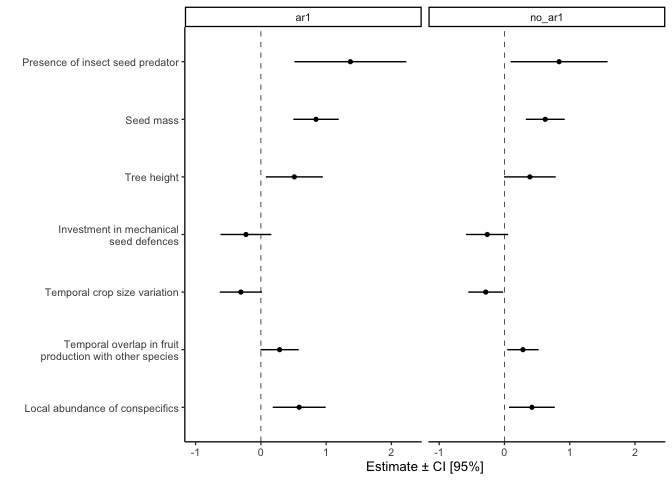

Test for temporal autocorrelation
================
Eleanor Jackson
07 July, 2021

``` r
library("tidyverse")
```

    ## ── Attaching packages ─────────────────────────────────────── tidyverse 1.3.1 ──

    ## ✓ ggplot2 3.3.3     ✓ purrr   0.3.4
    ## ✓ tibble  3.1.2     ✓ dplyr   1.0.7
    ## ✓ tidyr   1.1.3     ✓ stringr 1.4.0
    ## ✓ readr   1.4.0     ✓ forcats 0.5.1

    ## ── Conflicts ────────────────────────────────────────── tidyverse_conflicts() ──
    ## x dplyr::filter() masks stats::filter()
    ## x dplyr::lag()    masks stats::lag()

``` r
library("DHARMa")
```

    ## This is DHARMa 0.4.1. For overview type '?DHARMa'. For recent changes, type news(package = 'DHARMa') Note: Syntax of plotResiduals has changed in 0.3.0, see ?plotResiduals for details

``` r
library("glmmTMB")
library("broom.mixed")
library("patchwork")

fruit_traits <- readRDS(here::here("data", "clean", "fruit_traits.rds"))

set.seed(123)
```

## Fit models

``` r
# round number of seeds to integers or else DHARMa will not recognise as binomial
fruit_traits$abscised_seeds <- round(fruit_traits$abscised_seeds)
fruit_traits$viable_seeds <- round(fruit_traits$viable_seeds)

# transform
fruit_traits %>%
    mutate(cofruit_cs = scale(cofruit),
    height_avg_cs = scale(height_avg),
    cvseed_cs = scale(cvseed),
    endocarp_investment_cs = scale(endocarp_investment),
    seed_dry_log = log(seed_dry),
    bcireproductive_log = log(bcireproductive)) %>%
    mutate(seed_dry_log_cs = scale(seed_dry_log),
    bcireproductive_log_cs = scale(bcireproductive_log),
    seedpred_pres = as.factor(seedpred_pres)) -> fruit_traits
```

``` r
# select variables to loop over
vars <- c("height_avg_cs","cvseed_cs","cofruit_cs","endocarp_investment_cs",
        "seedpred_pres","seed_dry_log_cs","bcireproductive_log_cs")

vars <- setNames(vars, vars)

# loop model fitting over all the plant population attributes/traits

models <- lapply(setNames(vars, vars), function(var) {
    formula <- eval(parse(text=(paste("cbind(abscised_seeds, viable_seeds) ~", var,
                    "+ (1|year) + (1|sp4)", sep = ""))))
    glmmTMB::glmmTMB(formula, data = fruit_traits, family = binomial(link = logit),
                     na.action = "na.omit")
    }
)
```

## Test for temporal autocorrelation in the residuals

We need to get the residuals separately for each species in each model
because testing for temporal autocorrelation requires unique time
values.

I’m going to use the “normalised” residuals because they also take the
random effect terms into account. See
[here](https://stats.stackexchange.com/questions/80823/do-autocorrelated-residual-patterns-remain-even-in-models-with-appropriate-corre)

I’ll use a Durbin-Watson test to look for autocorrelation.

``` r
# function to get residuals
get_resids <- function(try_species, trait) {
  fruit_traits %>%
    drop_na(trait) %>%
    mutate(residuals = residuals(models[[trait]]), model = trait, type = "normalized") %>%
    dplyr::filter(sp4 == try_species)
}

keys <- expand.grid(unique(fruit_traits$sp4), vars) %>%
  rename(try_species = Var1, trait = Var2)

# loop over every combo of species and model
# not all species are in every model - so remove those empty dfs
pmap(keys, get_resids) %>% 
  keep(~ nrow(.x) > 0) -> resid_dfs
```

    ## Note: Using an external vector in selections is ambiguous.
    ## ℹ Use `all_of(trait)` instead of `trait` to silence this message.
    ## ℹ See <https://tidyselect.r-lib.org/reference/faq-external-vector.html>.
    ## This message is displayed once per session.

``` r
# perform a Durbin-Watson test on the residuals
test_autocor <- function(df){
  DHARMa::testTemporalAutocorrelation(df[["residuals"]], df[["year"]], plot = FALSE) -> out
  tibble(statistic = out[["statistic"]], p = out[["p.value"]],
         sp4 = df[["sp4"]][[1]], model = df[["model"]][[1]])
}

test_dfs <- lapply(resid_dfs, test_autocor)

autocor_vals <- bind_rows(test_dfs)

autocor_vals %>% 
  filter(p < 0.05 & statistic <1) %>%
  arrange(statistic) -> sig_pos_autocor_vals

autocor_vals %>% 
  filter(p < 0.05 & statistic >3) %>%
  arrange(statistic) -> sig_neg_autocor_vals

sig_pos_autocor_vals
```

    ## # A tibble: 47 x 4
    ##    statistic           p sp4   model                 
    ##        <dbl>       <dbl> <fct> <fct>                 
    ##  1     0.534 0.000000785 HYEL  seed_dry_log_cs       
    ##  2     0.542 0.000000950 HYEL  endocarp_investment_cs
    ##  3     0.551 0.00000120  HYEL  cofruit_cs            
    ##  4     0.552 0.00000122  HYEL  seedpred_pres         
    ##  5     0.562 0.00000157  HYEL  bcireproductive_log_cs
    ##  6     0.562 0.00000158  HYEL  height_avg_cs         
    ##  7     0.606 0.0269      CERT  seed_dry_log_cs       
    ##  8     0.608 0.0272      CERT  endocarp_investment_cs
    ##  9     0.622 0.0296      CERT  seedpred_pres         
    ## 10     0.622 0.0296      CERT  cofruit_cs            
    ## # … with 37 more rows

``` r
sig_neg_autocor_vals
```

    ## # A tibble: 29 x 4
    ##    statistic        p sp4   model                 
    ##        <dbl>    <dbl> <fct> <fct>                 
    ##  1      3.01 0.00238  LUE1  endocarp_investment_cs
    ##  2      3.02 0.00201  LUE1  seed_dry_log_cs       
    ##  3      3.10 0.000707 PRIC  cvseed_cs             
    ##  4      3.15 0.000458 CHRC  cvseed_cs             
    ##  5      3.16 0.000414 CHRC  endocarp_investment_cs
    ##  6      3.16 0.000413 CHRC  seed_dry_log_cs       
    ##  7      3.16 0.000927 GUA1  bcireproductive_log_cs
    ##  8      3.16 0.000927 GUA1  height_avg_cs         
    ##  9      3.17 0.000858 GUA1  cofruit_cs            
    ## 10      3.17 0.000848 GUA1  seedpred_pres         
    ## # … with 19 more rows

Out of 867 values (one for each species in each model), 47 are showing
significant positive autocorrelation (5.42%) and 29 are showing
significant negative autocorrelation (3.34%). Looking at the tibbles
above, it’s interesting that some species show more temporal
autocorrelation than others. They are also consistently temporally
autocorrelated across models - which I think makes sense, as the same
values of proportion abscised are used.

We can also look at the AutoCorrelation Function (ACF), which is
calculated for each time lag.

``` r
# get autocorrelation values
test_autocor_acf <- function(df){
  acf(x = as.matrix(df[["residuals"]], df[["year"]]), plot = FALSE) -> out
  tibble(lag = out[["lag"]], acf = out[["acf"]],
         sp4 = df[["sp4"]][[1]], model = df[["model"]][[1]])
}

test_acf <- lapply(resid_dfs, test_autocor_acf)

acf_vals <- bind_rows(test_acf)

ggplot(acf_vals, aes(x=lag, y=acf, group = lag)) +
  geom_boxplot() +
  geom_hline(yintercept = 0, linetype="dashed") +
  geom_hline(yintercept = 0.5, linetype="dashed") +
  geom_hline(yintercept = -0.5, linetype="dashed") -> p1

p1
```

<!-- -->

This doesn’t look too bad - medians are close to zero, apart from at lag
2 where ACF is higher.

## Try fitting models with AR(1) covariance

I’m going to incorporate a AR(1) covariance structure to see how it
affects the autocorrelation and results.

``` r
# fit with covariance
models_ar1 <- lapply(setNames(vars, vars), function(var) {
    formula <- eval(parse(text=(paste("cbind(abscised_seeds, viable_seeds) ~", var,
                    "+ (1|sp4) + ar1(year + 0 | sp4)", sep = ""))))
    glmmTMB::glmmTMB(formula, data = fruit_traits, family = binomial(link = logit),
                     na.action = "na.omit")
    }
)
```

## Test for autocorrelation in the new models

``` r
get_resids_ar1 <- function(try_species, trait) {
  fruit_traits %>%
    drop_na(trait) %>%
    mutate(residuals = residuals(models_ar1[[trait]]), model = trait, type = "normalized") %>%
    dplyr::filter(sp4 == try_species)
}

pmap(keys, get_resids_ar1) %>%
  keep(~ nrow(.x) > 0) -> resid_dfs_ar1

# DW test
test_dfs_ar1 <- lapply(resid_dfs_ar1, test_autocor)

autocor_vals_ar1 <- bind_rows(test_dfs_ar1)

autocor_vals_ar1 %>% 
  filter(p < 0.05 & statistic <1) %>%
  arrange(statistic) -> sig_pos_autocor_vals_ar1

autocor_vals %>% 
  filter(p < 0.05 & statistic >3) %>%
  arrange(statistic) -> sig_neg_autocor_vals_ar1

sig_pos_autocor_vals_ar1
```

    ## # A tibble: 42 x 4
    ##    statistic         p sp4   model                 
    ##        <dbl>     <dbl> <fct> <fct>                 
    ##  1     0.410 0.0000664 OCHP  seed_dry_log_cs       
    ##  2     0.413 0.0000696 OCHP  endocarp_investment_cs
    ##  3     0.415 0.0000725 OCHP  seedpred_pres         
    ##  4     0.419 0.0000779 OCHP  cofruit_cs            
    ##  5     0.439 0.000110  OCHP  cvseed_cs             
    ##  6     0.565 0.000709  OCHP  bcireproductive_log_cs
    ##  7     0.571 0.000760  OCHP  height_avg_cs         
    ##  8     0.684 0.000246  TYNC  cvseed_cs             
    ##  9     0.696 0.000293  TYNC  cofruit_cs            
    ## 10     0.702 0.000318  TYNC  endocarp_investment_cs
    ## # … with 32 more rows

``` r
sig_neg_autocor_vals_ar1
```

    ## # A tibble: 29 x 4
    ##    statistic        p sp4   model                 
    ##        <dbl>    <dbl> <fct> <fct>                 
    ##  1      3.01 0.00238  LUE1  endocarp_investment_cs
    ##  2      3.02 0.00201  LUE1  seed_dry_log_cs       
    ##  3      3.10 0.000707 PRIC  cvseed_cs             
    ##  4      3.15 0.000458 CHRC  cvseed_cs             
    ##  5      3.16 0.000414 CHRC  endocarp_investment_cs
    ##  6      3.16 0.000413 CHRC  seed_dry_log_cs       
    ##  7      3.16 0.000927 GUA1  bcireproductive_log_cs
    ##  8      3.16 0.000927 GUA1  height_avg_cs         
    ##  9      3.17 0.000858 GUA1  cofruit_cs            
    ## 10      3.17 0.000848 GUA1  seedpred_pres         
    ## # … with 19 more rows

Out of 867 values (one for each species in each model), 42 are showing
significant positive autocorrelation. This is 5 less than the models
without the AR(1) covariance structure. 29 are showing significant
negative correlation, the same as the models without the AR(1)
covariance structure.

``` r
# autocorrelation values
test_autocor_acf <- function(df){
  acf(x = as.matrix(df[["residuals"]], df[["year"]]), plot = FALSE) -> out
  tibble(lag = out[["lag"]], acf = out[["acf"]],
         sp4 = df[["sp4"]][[1]], model = df[["model"]][[1]])
}

test_acf_ar1 <- lapply(resid_dfs_ar1, test_autocor_acf)

acf_vals_ar1 <- bind_rows(test_acf_ar1)

ggplot(acf_vals_ar1, aes(x=lag, y=acf, group = lag)) +
  geom_boxplot() +
  geom_hline(yintercept = 0, linetype="dashed") +
  geom_hline(yintercept = 0.5, linetype="dashed") +
  geom_hline(yintercept = -0.5, linetype="dashed") +
  ggtitle("with AR(1)") -> p2

p1 + p2
```


Some of the ACF values look better and some look worse. Lag 2 has been
brought down a little.

## Compare model results

Note that I had to install a fix for `broom.mixed::tidy` to give
confidence intervals for `glmmTMB` models. See
[here](https://github.com/glmmTMB/glmmTMB/issues/401)

``` r
#effects
res_anova <- purrr::map_dfr(models, effect="fixed", broom.mixed::tidy,
                            conf.int = TRUE, .id = "vars")
results <- res_anova[!grepl("(Intercept)", res_anova$term),]

res_anova_ar1 <- purrr::map_dfr(models_ar1, effect="fixed", broom.mixed::tidy,
                            conf.int = TRUE, .id = "vars")
results_ar1 <- res_anova_ar1[!grepl("(Intercept)", res_anova_ar1$term),]

results %>%
  mutate(model = "no_ar1") -> results

results_ar1 %>%
  mutate(model = "ar1") -> results_ar1

rbind(results, results_ar1) -> plot_dat

labs <- c(
            height_avg_cs = "Tree height",
            cvseed_cs = "Temporal crop size variation",
            cofruit_cs = "Temporal overlap in fruit\nproduction with other species",
            bcireproductive_log_cs = "Local abundance of conspecifics",
            endocarp_investment_cs = "Investment in mechanical\nseed defences",
            seed_dry_log_cs ="Seed mass",
            proportion_abscised = "Proportion of seeds abscised",
              seedpred_pres = "Presence of insect seed predator")

ggplot(plot_dat, aes(x = vars, y= estimate)) +
    geom_pointrange(aes(ymin = conf.low, ymax = conf.high),
        size = 0.5, fatten = 1)  +
    geom_hline(yintercept = 0, linetype = 2, size = 0.25)  +
    labs(y = "Estimate ± CI [95%]", x = "") +
    scale_x_discrete(labels = labs) +
    scale_y_continuous(limits = c(-1, 2.3)) +
    coord_flip() +
    facet_grid(~model) +
    theme_classic(base_size = 10)
```

<!-- -->

Only a very small change in the results! Reassuring that it wouldn’t
change our conclusions if we decided to use the AR(1) covariance
structure. However, I think that the autocorrelation we see in our model
residuals is minimal and we don’t need to adjust for it.
