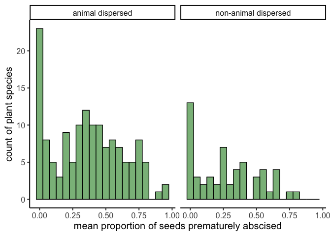
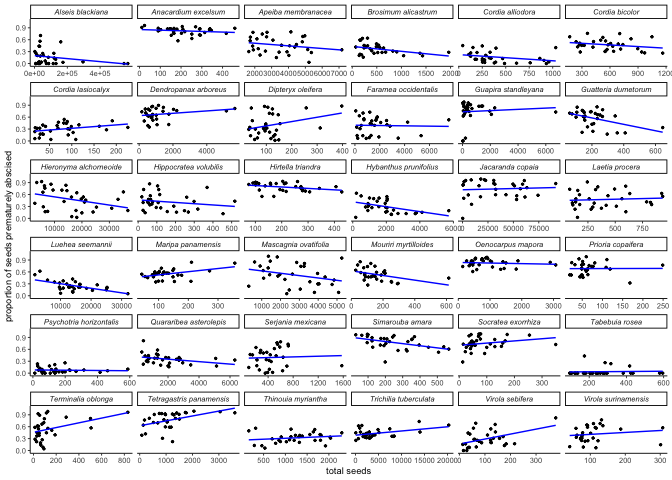

Explore reviewer comments
================
Eleanor Jackson
26 October, 2021

``` r
library("tidyverse")
```

    ## ── Attaching packages ─────────────────────────────────────── tidyverse 1.3.1 ──

    ## ✓ ggplot2 3.3.5     ✓ purrr   0.3.4
    ## ✓ tibble  3.1.2     ✓ dplyr   1.0.7
    ## ✓ tidyr   1.1.3     ✓ stringr 1.4.0
    ## ✓ readr   1.4.0     ✓ forcats 0.5.1

    ## ── Conflicts ────────────────────────────────────────── tidyverse_conflicts() ──
    ## x dplyr::filter() masks stats::filter()
    ## x dplyr::lag()    masks stats::lag()

``` r
fruit_traits <- readRDS(here::here("data", "clean", "fruit_traits.rds"))
```

## Is there a difference in fruit drop rates between plant species with different dispersal vectors?

We have data on dispersal modes for 199 species in the dataset. Some of
the plant species fall into multiple categories of dispersal mode.

``` r
disp_mode <- read.csv(here::here("data", "extra", "species_20070228_DispersalModes.csv"))

disp_mode %>%
  pivot_longer(cols = c(dsp_ant, dsp_bat, dsp_bird, dsp_bbird, dsp_explo, dsp_mam, dsp_water, dsp_wind),
               names_to = "disp_mode") %>% 
  filter(value == TRUE) %>%
  add_count(sp, sort = TRUE) -> disp_dat

fruit_traits %>%
    select("sp4","year", "proportion_abscised") %>%
    group_by(sp4) %>%
    summarise(proportion_abscised_m = mean(proportion_abscised)) %>%
  inner_join(disp_dat, by = c("sp4" = "sp")) -> disp_fruit


ggplot(disp_fruit, aes(x=proportion_abscised_m, fill = as.factor(n))) +
  geom_histogram(binwidth=.05, position="stack", colour="black", alpha=0.8) + 
  facet_wrap(~disp_mode) +
  theme_classic(base_size = 9) +
  xlab("mean proportion of seeds prematurely abscised") +
  ylab("count of plant species") +
  labs(fill = "number of \ndispersal modes") 
```

<!-- -->

Looking at this, it doesn’t seem like there is evidence for a difference
in fruit drop between plants which are animal dispersed vs wind
dispersed. We can make this clearer by combining the different animal
dispersers into one category.

``` r
disp_mode %>%
  pivot_longer(cols = c(dsp_ant, dsp_bat, dsp_bird, dsp_bbird, dsp_explo, dsp_mam, dsp_water, dsp_wind),
               names_to = "disp_mode") %>% 
  filter(value == TRUE) %>%
  mutate(bio = ifelse(disp_mode=="dsp_explo"|disp_mode=="dsp_wind"|disp_mode=="dsp_water", "non-animal dispersed", "animal dispersed")) %>%
  select(-disp_mode) %>%
  distinct() %>%
  add_count(sp, sort = TRUE) %>%
  filter(n != 2)-> disp_dat_bio

fruit_traits %>%
    select("sp4","year", "proportion_abscised") %>%
    group_by(sp4) %>%
    summarise(proportion_abscised_m = mean(proportion_abscised)) %>%
  inner_join(disp_dat_bio, by = c("sp4" = "sp")) %>%
  ggplot(aes(x=proportion_abscised_m)) +
  geom_histogram(binwidth=.05, fill="forestgreen", colour = "black", alpha = 0.6) + 
  facet_wrap(~bio) +
  theme_classic(base_size = 15) +
  xlab("mean proportion of seeds prematurely abscised") +
  ylab("count of plant species") 
```

<!-- -->

Let’s test for a difference with a glm

``` r
fruit_traits %>%
  mutate(
    abscised_seeds = round(abscised_seeds),
    viable_seeds = round(viable_seeds)
  ) %>%
  inner_join(select(disp_dat_bio, sp, bio), by = c("sp4" = "sp")) -> fruit_traits_disp

m <- lme4::glmer(cbind(abscised_seeds, viable_seeds)~ bio + (1|year) + (1|sp4),
            family = binomial(logit), data = fruit_traits_disp)

broom.mixed::tidy(m, conf.int = TRUE) -> results
results
```

    ## # A tibble: 4 x 9
    ##   effect  group term    estimate std.error statistic  p.value conf.low conf.high
    ##   <chr>   <chr> <chr>      <dbl>     <dbl>     <dbl>    <dbl>    <dbl>     <dbl>
    ## 1 fixed   <NA>  (Inter…   -0.921     0.217     -4.25  2.10e-5    -1.35    -0.497
    ## 2 fixed   <NA>  bionon…   -0.543     0.369     -1.47  1.41e-1    -1.27     0.180
    ## 3 ran_pa… sp4   sd__(I…    2.32     NA         NA    NA          NA       NA    
    ## 4 ran_pa… year  sd__(I…    0.519    NA         NA    NA          NA       NA

There is no difference in mean proportion of fruits prematurely abscised
between species that were animal dispersed and those that were not (GLM,
estimate = -0.5427406 95% CI \[-1.2651924, 0.1797111\], p = 0.1409076 ).

## Did the proportion of fruits dropped increase as the overall fruit count increased?

*"Resource limitation is likely to be stronger if there are more
flowers/fruit –* ***did the proportion of fruits dropped increase as the
overall fruit count increased?*** *"*

``` r
# take a selection of best temporally sampled species
fruit_traits %>%
    group_by(sp4) %>%
    summarise(n_years = length(unique(year))) %>%
    filter(n_years == 31) %>%
  pull(sp4) -> sp_31

# plot proportion abscised against total seeds per species
fruit_traits %>%
  filter(sp4 %in% sp_31) %>%
  mutate(taxa = paste(genus, species, sep=" ")) %>%
  ggplot(aes(x = total_seeds, y = proportion_abscised))+
  geom_point(size = 0.5) +
  facet_wrap(~taxa, scales = "free_x") + 
  geom_smooth(colour = "blue", method = "lm", se = FALSE, size = 0.5) +
  theme_classic(base_size = 7) +
  theme(strip.text = element_text(face = "italic")) +
  ylab("proportion of seeds prematurely abscised") +
  xlab("total seeds")
```

    ## `geom_smooth()` using formula 'y ~ x'

<!-- -->

Seems to be no clear evidence for premature fruit drop being higher in
years of high overall fruit production.
