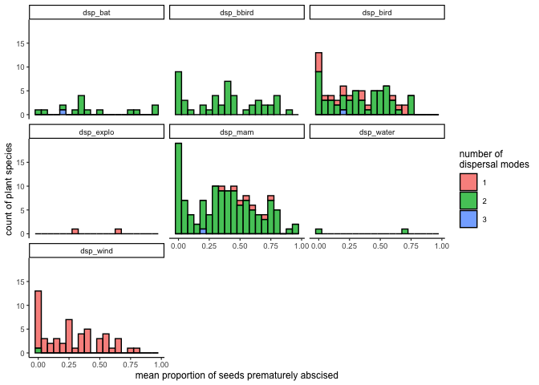

Explore reviewer comments
================
Eleanor Jackson
10 November, 2021

``` r
library("tidyverse")
```

    ## ── Attaching packages ─────────────────────────────────────── tidyverse 1.3.1 ──

    ## ✓ ggplot2 3.3.5     ✓ purrr   0.3.4
    ## ✓ tibble  3.1.5     ✓ dplyr   1.0.7
    ## ✓ tidyr   1.1.4     ✓ stringr 1.4.0
    ## ✓ readr   2.0.2     ✓ forcats 0.5.1

    ## ── Conflicts ────────────────────────────────────────── tidyverse_conflicts() ──
    ## x dplyr::filter() masks stats::filter()
    ## x dplyr::lag()    masks stats::lag()

``` r
library("lubridate")
```

    ## 
    ## Attaching package: 'lubridate'

    ## The following objects are masked from 'package:base':
    ## 
    ##     date, intersect, setdiff, union

``` r
fruit_traits <- readRDS(here::here("data", "clean", "fruit_traits.rds"))
```

## Is temporal overlap in fruit production correlated with fruiting season duration (i.e. species that fruit for a long time will have a lot of other co-fruiting species)?

``` r
# original source of cofruit variable from Wright et al. 2016 Ecology
wright_SI <- read.csv(here::here("data", "extra", "CensusTrapSp.csv"))

# how many weeks in a year is fruit found for each species?
wright_SI %>% 
  group_by(sp) %>%
  mutate(week = census %% 52) %>%
  summarise(no_weeks = n_distinct(as.factor(week))) -> no_week_d

# join to trait data and plot
inner_join(fruit_traits, no_week_d, by = c("sp6" = "sp")) %>%
  ggplot(aes(y = cofruit, x = no_weeks)) +
  geom_point() +
  xlab("Number of weeks in the year that fruit is found") +
  ylab("Number of other species observed to fruit in the same week") +
  theme_classic(base_size = 10)
```

    ## Warning: Removed 22 rows containing missing values (geom_point).

<!-- -->

Species which fruit at the same time as many other species in our
dataset also fruit for a longer time period. This may increase the
chance that they will be found by seed predators, and could have
contributed to the positive correlation between temporal overlap in
fruiting period and premature seed abscission.

## Is there a difference in fruit drop rates between plant species with different dispersal vectors?

We have data on dispersal modes for 199 species in the dataset. Some of
the plant species fall into multiple categories of dispersal mode.

``` r
disp_mode <- read.csv(here::here("data", "extra", "species_20070228_DispersalModes.csv"))

disp_mode %>%
  pivot_longer(cols = c(dsp_ant, dsp_bat, dsp_bird, dsp_bbird, dsp_explo, dsp_mam, dsp_water, dsp_wind),
               names_to = "disp_mode") %>% 
  filter(value == TRUE) %>%
  add_count(sp, sort = TRUE) -> disp_dat

fruit_traits %>%
    select("sp4","year", "proportion_abscised") %>%
    group_by(sp4) %>%
    summarise(proportion_abscised_m = mean(proportion_abscised)) %>%
  inner_join(disp_dat, by = c("sp4" = "sp")) -> disp_fruit


ggplot(disp_fruit, aes(x=proportion_abscised_m, fill = as.factor(n))) +
  geom_histogram(binwidth=.05, position="stack", colour="black", alpha=0.8) + 
  facet_wrap(~disp_mode) +
  theme_classic(base_size = 9) +
  xlab("mean proportion of seeds prematurely abscised") +
  ylab("count of plant species") +
  labs(fill = "number of \ndispersal modes") 
```

<!-- -->

Looking at this, it doesn’t seem like there is evidence for a difference
in fruit drop between plants which are animal dispersed vs wind
dispersed. We can make this clearer by combining the different animal
dispersers into one category.

``` r
disp_mode %>%
  pivot_longer(cols = c(dsp_ant, dsp_bat, dsp_bird, dsp_bbird, dsp_explo, dsp_mam, dsp_water, dsp_wind),
               names_to = "disp_mode") %>% 
  filter(value == TRUE) %>%
  mutate(bio = ifelse(disp_mode=="dsp_explo"|disp_mode=="dsp_wind"|disp_mode=="dsp_water", "non-animal dispersed", "animal dispersed")) %>%
  select(-disp_mode) %>%
  distinct() %>%
  add_count(sp, sort = TRUE) %>%
  filter(n != 2)-> disp_dat_bio

fruit_traits %>%
    select("sp4","year", "proportion_abscised") %>%
    group_by(sp4) %>%
    summarise(proportion_abscised_m = mean(proportion_abscised)) %>%
  inner_join(disp_dat_bio, by = c("sp4" = "sp")) %>%
  ggplot(aes(x=proportion_abscised_m)) +
  geom_histogram(binwidth=.05, fill="forestgreen", colour = "black", alpha = 0.6) + 
  facet_wrap(~bio) +
  theme_classic(base_size = 15) +
  xlab("mean proportion of seeds prematurely abscised") +
  ylab("count of plant species") 
```

<!-- -->

Let’s test for a difference with a glm

``` r
fruit_traits %>%
  mutate(
    abscised_seeds = round(abscised_seeds),
    viable_seeds = round(viable_seeds)
  ) %>%
  inner_join(select(disp_dat_bio, sp, bio), by = c("sp4" = "sp")) -> fruit_traits_disp

m <- lme4::glmer(cbind(abscised_seeds, viable_seeds)~ bio + (1|year) + (1|sp4),
            family = binomial(logit), data = fruit_traits_disp)

broom.mixed::tidy(m, conf.int = TRUE) -> results
results
```

    ## # A tibble: 4 × 9
    ##   effect   group term   estimate std.error statistic  p.value conf.low conf.high
    ##   <chr>    <chr> <chr>     <dbl>     <dbl>     <dbl>    <dbl>    <dbl>     <dbl>
    ## 1 fixed    <NA>  (Inte…   -0.921     0.217     -4.25  2.10e-5    -1.35    -0.497
    ## 2 fixed    <NA>  biono…   -0.543     0.369     -1.47  1.41e-1    -1.27     0.180
    ## 3 ran_pars sp4   sd__(…    2.32     NA         NA    NA          NA       NA    
    ## 4 ran_pars year  sd__(…    0.519    NA         NA    NA          NA       NA

There is no difference in proportion of fruits prematurely abscised
between species that were animal dispersed and those that were not (GLM,
estimate = -0.5427406 95% CI \[-1.2651924, 0.1797111\], p = 0.1409076, n
= 199).

## Did the proportion of fruits dropped increase as the overall fruit count increased?

*"Resource limitation is likely to be stronger if there are more
flowers/fruit –* ***did the proportion of fruits dropped increase as the
overall fruit count increased?*** *"*

``` r
# take a selection of best temporally sampled species
fruit_traits %>%
    group_by(sp4) %>%
    summarise(n_years = length(unique(year))) %>%
    filter(n_years == 31) %>%
  pull(sp4) -> sp_31

# plot proportion abscised against total seeds per species
fruit_traits %>%
  filter(sp4 %in% sp_31) %>%
  mutate(taxa = paste(genus, species, sep=" ")) %>%
  ggplot(aes(x = total_seeds, y = proportion_abscised))+
  geom_point(size = 0.5) +
  facet_wrap(~taxa, scales = "free_x") + 
  geom_smooth(colour = "blue", method = "lm", se = FALSE, size = 0.5) +
  theme_classic(base_size = 7) +
  theme(strip.text = element_text(face = "italic")) +
  ylab("proportion of seeds prematurely abscised") +
  xlab("total seeds")
```

    ## `geom_smooth()` using formula 'y ~ x'

<!-- -->

Seems to be no clear evidence for premature fruit drop being higher in
years of high overall fruit production.

## Flowering and fruiting phenology

Reviewer suggested that the negative correlation between temporal
variation in crop size and rates of premature fruit drop could instead
be due to closer tracking of environmental conditions by the plant.

i.e. a plant that tracks the environment closely avoids reproduction
entirely in poor years while a plant that tracks the environment less
closely initiates reproduction and must then abort immature fruit.

Species with a short time between flowering and fruiting could track the
environment better than a species with extended fruit development. Fruit
development time varies interspecifically from a couple of weeks to
almost a full year. Would be difficult for a species that takes 11
months to develop fruit to anticipate the next 11 months of climate
variation.

If tracking of environmental conditions correlates with proportion of
fruit prematurely abscised, we would expect to see short fruit
development time -&gt; low fruit drop

``` r
#  calculate fruit development time as overall mean fruiting date minus the overall mean flowering date
# exclude species that fruit more than once in a year
# then look at proportion abscised ~ fruit development time

bci_phenology <- read.csv(here::here("data", "extra", "bci_phenology.csv"))

seed_rain <- read.table(here::here("data", "raw", "BCI_TRAP200_20190215_spcorrected.txt"),
                        header=TRUE, stringsAsFactors = FALSE)

## clean seed rain data
seed_rain$fecha <- as.character(seed_rain$fecha)
seed_rain$fecha <- as.Date(seed_rain$fecha, "%Y-%m-%d")
seed_rain$year <- format(as.Date(seed_rain$fecha), "%Y")
seed_rain$day <- lubridate::yday(seed_rain$fecha)

# date is from 1987-01-12 to 2019-01-29, we only want complete years so remove year=2019 and year=1987
seed_rain <- subset(seed_rain, seed_rain$year != "1987" & seed_rain$year != "2019")

# rename sp as sp4
seed_rain <- rename(seed_rain, sp4 = sp)

## calculate mean fruiting date (mature fruit, part 1) and 
## mean flowering date (perfect female flowers, part 6) per species

# flowering
bci_phenology %>%
  filter(type == "flw", period_2 == "annual") %>%
  pull("sp") -> annual_flw

seed_rain %>%
  filter(sp4 %in% annual_flw, part == 6) %>%
  group_by(sp4) %>%
  summarise(mean_flw = mean(day), n = n()) -> mean_annual_flw

# fruiting
bci_phenology %>%
  filter(type == "frt", period_2 == "annual") %>%
  pull("sp") -> annual_frt

seed_rain %>%
  filter(sp4 %in% annual_frt, part == 1) %>%
  group_by(sp4) %>%
  summarise(mean_frt = mean(day), n = n()) -> mean_annual_frt

# plot mean proportion abscised and (mean fruit date - mean flower date)
fruit_traits %>%
    select("sp4","year", "proportion_abscised") %>%
    group_by(sp4) %>%
    summarise(proportion_abscised_m = mean(proportion_abscised)) %>%
  inner_join(mean_annual_frt, by = "sp4") %>% 
  inner_join(mean_annual_flw, by = "sp4") %>% 
  mutate(fruit_develop_time = abs(mean_frt - mean_flw)) %>%
  ggplot(aes(y = proportion_abscised_m, x = fruit_develop_time)) +
  geom_point() +
  geom_smooth(colour = "blue", method = "lm", se = FALSE, size = 0.5)+
  ylab("mean proportion of seeds prematurely abscised") +
  xlab("mean fruit development time (days)") +
  theme_classic(base_size = 9)
```

    ## `geom_smooth()` using formula 'y ~ x'

<!-- -->

``` r
# run a glm
fruit_traits %>%
  mutate(
    abscised_seeds = round(abscised_seeds),
    viable_seeds = round(viable_seeds)) %>% 
  inner_join(mean_annual_frt, by = "sp4") %>% 
  inner_join(mean_annual_flw, by = "sp4") %>% 
  mutate(fruit_develop_time = abs(mean_frt - mean_flw)) -> fruit_traits_pheno

m2 <- lme4::glmer(cbind(abscised_seeds, viable_seeds) ~ fruit_develop_time + (1|year) + (1|sp4),
            family = binomial(logit), data = fruit_traits_pheno)

broom.mixed::tidy(m2, conf.int = TRUE) -> results2
results2
```

    ## # A tibble: 4 × 9
    ##   effect   group term    estimate std.error statistic p.value conf.low conf.high
    ##   <chr>    <chr> <chr>      <dbl>     <dbl>     <dbl>   <dbl>    <dbl>     <dbl>
    ## 1 fixed    <NA>  (Inter… -5.06e-1   0.336      -1.51    0.132 -1.16      0.152  
    ## 2 fixed    <NA>  fruit_…  6.80e-4   0.00389     0.175   0.861 -0.00695   0.00831
    ## 3 ran_pars sp4   sd__(I…  1.55e+0  NA          NA      NA     NA        NA      
    ## 4 ran_pars year  sd__(I…  6.40e-1  NA          NA      NA     NA        NA

There is no correlation between proportion of fruits prematurely
abscised and fruit development time (GLM, estimate = 6.7992465^{-4} 95%
CI \[-0.0069523, 0.0083121\], p = 0.8613897, n = 88 species).
